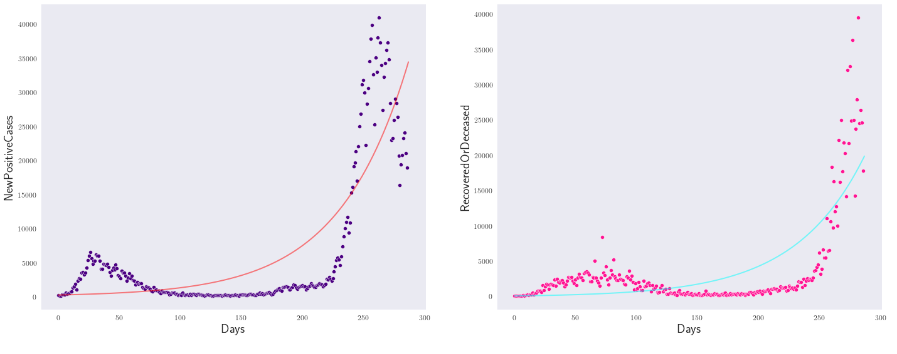
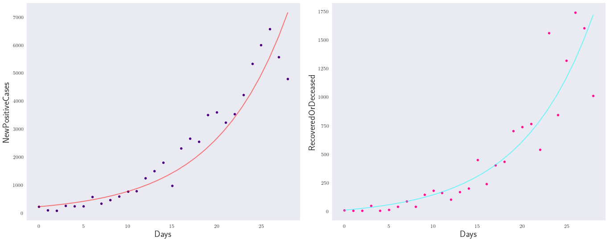

# SIR and SEIR models on Italy's Covid data

After reading the data, we aggregate the columns that represent the number of cases, recovered and deceased individuals by date. The latter column represent the total number of deaths and recovered individuals at time $t$, so we consider the difference between consecutive days as the daily change in this feature. The final data on which we will be working looks like this. 

We will compare two models: SIR and SEIR. 

## SIR model
The basic SIR model assumes that the population is composed by three compartments at any given time $t$: susceptible individuals (S), infectious individuals (I) and the number of recovered/deceased individuals (R).

$$\begin{align}
\frac{\mathrm{d} S}{\mathrm{d} t} &= -\beta\, \frac{SI}{N}\\
\frac{\mathrm{d} I}{\mathrm{d} t} &= \beta\, \frac{SI}{N} - \gamma\,I\\
\frac{\mathrm{d} R}{\mathrm{d} t} &= \gamma\,I
\end{align}$$

where

$$\begin{align}
\beta &= \text{Contact Rate } \times \text{ Probability of Transmission}\\
\gamma &= \text{Recovery Rate} = \frac{1}{t_{\text{infectious}}}
\end{align}$$

## SEIR model

This model is an extension to the SIR model: it takes into account the fact that there exists an incubation period (1-14 Days, most commonly 5 days (WHO)) in which the individual has been infected but not yet infectious. This is represented by the compartment (E) of exposed individuals.

$$\begin{align}
\frac{\mathrm{d} S}{\mathrm{d} t} &= -\frac{\beta\,S\,I}{N}\\
\frac{\mathrm{d} E}{\mathrm{d} t} &= \frac{\beta \,S\,I}{N} - \sigma\,E\\
\frac{\mathrm{d} I}{\mathrm{d} t} &= \sigma\,E-\gamma\,I \\
\frac{\mathrm{d} R}{\mathrm{d} t} &= \gamma\,I
\end{align}$$

where

$$\begin{align}
\beta &= \text{Infectious Rate }\\
\sigma &= \text{Incubation rate} &= \frac{1}{t_incubation}\\
\gamma &= \text{Recovery Rate}\\
\end{align}$$

i.e. $\beta$ controls the rate of spread which represents the probability of transmitting disease between a susceptible and an infectious individual and $\sigma$ is the rate of latent individuals becoming infectious.  A closed population with no births or deaths is assumed. 

## Differential evolution
The differential evolution package PDE_params estimates the best candidates for the parameters $\beta$, $\gamma$ of the SIR model and the parameters $\beta$, $\sigma$, $\gamma$ of the SEIR model. The corresponding values are $\beta=0.0278$, $\gamma=0.0102$ and $\beta=0.258$, $\gamma=0.013$, $\sigma=0.003$ for the SIR and SEIR model respectively. With these constants, we can integrate the system of ODEs and estimate the curves for the evolution of the new cases and the deceased/recovered individuals as seen in the next figure for the SIR model. For the SEIR Model check the Jupyter notebook on this repository, it is very similar. 

It is clear from the above plots that the evolution of Covid-19 is too complex to be capture accurately with such simple models. However, if we limit ourselves to the first 28 days of the pandemic and run our code again, we obtain $\beta=0.155$ and $\gamma=0.0306$ for the SIR model and the corresponding curves are as follows. 

We see that this captures really well the behaviour of the new cases and the deceased/recovered on the first 24 days of the pandemic. 

Data downloaded from: https://www.kaggle.com/sudalairajkumar/covid19-in-italy

Python package: https://github.com/systemsmedicine/PDE_params
